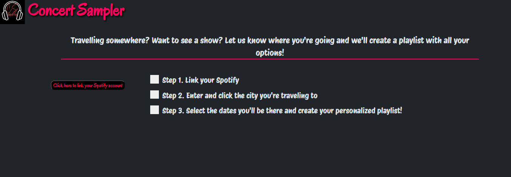
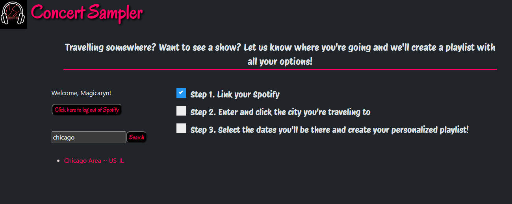
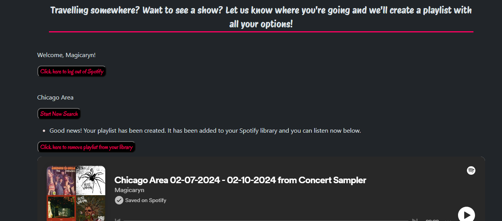
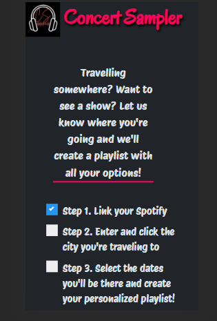

# ConcertSampler

Check out the deployed application here: [Concert Sampler](https://briandwach.github.io/concertsampler/)

This application is a great find for anyone that enjoys traveling! This web application allows for you to link your Spotify account and get a playlist from all the artists performing in that city on the days that you are traveling there. The app makes it easy with the simple steps that we have for you.

 Step 1, you will link your Spotify account. 

 

 Step 2, you search the city you will be traveling to. 

 Step 3, enter your dates and click get my playlist! 

This application uses two different API sources, one being Jambase and the second being Spotify. Some of the challenges we faced were finding a good source to connect the concert data to the user and getting our playlist to contain not only one artist but a few tracks from all of the artists that are performing on those specific dates. We used bootstrap for some of the UI components in addition to google fonts to create a fun interactive application for the user.

This application is also mobile friendly and will not have any issues when using different devices.

DISCLAIMER: To use this application while in Spotify's development mode, please send your Full Name and email associated with your Spotify user account (free or premium) to brian.d.wach@gmail.com.  You will be able to utilize the application after receiving confirmation from Brian Wach that you have been registered.